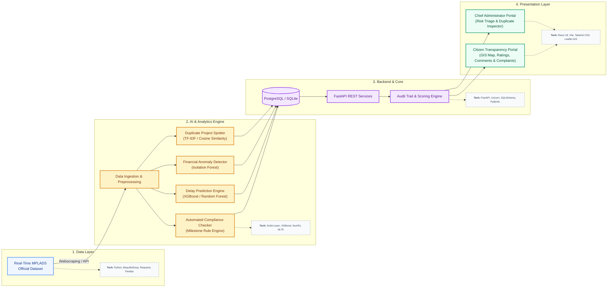

# SIH26102: MPLADS AI-Monitoring Platform (MoSPI)

## Official Problem Statement
**Description:** Develop an AI-powered monitoring and analytics platform for MPLADS that leverages Machine Learning (ML), Artificial Intelligence (AI), and advanced data analytics to identify trend, anomalies, irregularities, and potential fraud in fund utilization and project execution. The solution should analyze data relating to sanctions, expenditures, cost estimates, work progress, payments, and asset creation to detect unusual patterns, cost overruns, duplicate works, delayed projects, and deviations from established norms. The system should generate risk-based alerts, predictive insights, and decision-support dashboards for Members of Parliament, State Nodal Authorities, District Authorities, and the Ministry. The platform should also facilitate automated compliance monitoring, trend analysis, and early warning mechanisms to improve transparency, accountability, and efficiency in the implementation of MPLADS works across the country.

**Expected Solution:** The proposed solution should be an AI-powered platform that helps monitor MPLADS works and fund utilization in a smarter and more efficient manner. By analyzing data related to project approvals, expenditures, payments, work progress, and completion status, the system should be able to identify unusual patterns, delays, cost overruns, duplicate works, and potential cases of misuse of funds. It should automatically generate alerts and highlight high-risk cases that require attention from the concerned authorities. The platform should provide easy-to-understand dashboards and insights to Members of Parliament, State Nodal Authorities, District Authorities, and the Ministry, enabling them to make informed decisions and take timely corrective action. By leveraging artificial intelligence and data analytics, the solution should enhance transparency, strengthen accountability, reduce manual monitoring efforts, and support more effective implementation of MPLADS works across the country.

---

## Proposed Solution Architecture
Here is an end-to-end breakdown and proposed solution for developing the AI-powered monitoring platform for the MPLADS scheme.

This solution is structured to be practical, scalable, and directly address the problem of detecting fraud, anomalies, and inefficiencies.

---

## 1. Deconstructing the Problem

The MPLAD scheme manages thousands of localized community projects (roads, schools, water supply) recommended by MPs. Because funds pass through the Ministry → State → District Authorities → Implementing Agencies, monitoring is highly fragmented.

**The core challenges to solve are:**

* **Fund Leakage:** Inflated cost estimates, siphoning of funds, or payments made without actual work.
* **Duplicate Works:** Funding the same asset twice under different names or overlapping schemes.
* **Inefficiencies:** Chronic delays in execution, unutilized funds sitting in accounts, and cost overruns.
* **Lack of Visibility:** Authorities struggle to manually track the progress and compliance of thousands of distributed micro-projects.

## 2. Core Features of the Solution

An intelligent risk triage and transparency platform sitting on top of the MPLADS ecosystem, powered by 4 core intelligence engines integrated across both citizen and administrative dashboards:

### A. Core Intelligence Engines (Integrated in Both Dashboards)
1. **Smart Anomaly Detection:** Unsupervised Isolation Forest models automatically flag projects where proposed expenditure or duration deviates significantly from historical regional benchmarks.
2. **Duplicate Project Spotter (NLP):** Natural Language Processing (TF-IDF N-grams & Cosine Similarity) compares project titles and descriptions to detect duplicate or ghost works sanctioned in the same ward/panchayat.
3. **Delay Prediction Engine:** Evaluates completion probability and flags projects at high risk of stalling based on implementing agency track records and historical delivery timelines.
4. **Automated Compliance Checker:** Rules-based engine verifying MoSPI guideline adherence and ensuring installment disbursements are bound to verified milestone deliverables.

---

### B. Role-Specific Dashboards & Capabilities

#### 1. Chief Administrator Portal (Governance, Audit & Enforcement)
* **Risk Triage Console:** Prioritized queue of flagged high-risk projects requiring administrative review or fund disbursement freezes.
* **NLP Duplicate Inspector:** Deep-dive side-by-side text analysis comparing new proposals against historical ward databases.
* **Citizen Grievance Triage Queue:** Aggregates and prioritizes ground-level complaints and low-rated works for physical site inspections.
* **Defensible Audit Trail Generator:** Produces human-readable evidence logs detailing the exact mathematical and heuristic trigger reasons behind every alert.

#### 2. Citizen Transparency Portal (Civic Oversight & Ground Truth)
* **Constituency Fund Explorer:** Complete public visibility into recommended works, sanctioned amounts, expenditure, and live AI risk flags in local neighborhoods.
* **Interactive GIS Mapping:** Geospatial visualization of community assets (roads, water tanks, schools) showing progress, expenditure, and status.
* **Project Rating System (1–5 Stars):** Community quality scoring allowing residents to rate delivered infrastructure.
* **Public Comments & Ground Truth:** Direct civic discussions allowing locals to verify whether sanctioned assets physically exist and function.
* **Geo-Tagged Grievance Reporting:** Direct channel for citizens to lodge complaints against stalled works, sub-standard materials, or ghost projects.

---

## 3. System Architecture & Technical Flow

---

## 4. The AI & Analytics Engine (The "Brain")

| Use Case | AI/ML Technique | How it Works |
| --- | --- | --- |
| **Detecting Financial Anomalies** | Isolation Forests / Outlier Ensembles | Identifies statistical outliers in fund allocation. *Example: A standard community hall costs ₹15 Lakhs, but a proposal requests ₹48 Lakhs.* |
| **Spotting Duplicate Works** | NLP (TF-IDF N-Grams + Cosine Sim / Embeddings) | Vectorizes work descriptions across historical databases to catch identical or reworded projects in the same geographic bounds. |
| **Predicting Project Delays** | XGBoost / Random Forest Classifiers | Analyzes past execution duration across implementing agency types and work classifications to score completion risk. |
| **Compliance & Audit Verification** | Deterministic Milestone & Rule Engine | Enforces MoSPI guideline compliance, installment release conditions, and milestone validation before fund disbursement. |

---

## 5. End-to-End System Workflow

1. **Data Ingestion & Integration:** 
   Connects to the official MPLADS portal via Web Scraping / APIs to ingest real-time and historical datasets (works recommended, sanctioned, expenditure, and status).
2. **Data Cleansing & Preprocessing:** 
   Sanitizes and normalizes records, handles missing fields, and standardizes localized project descriptions for vector analysis.
3. **AI Processing & Risk Scoring:** 
   NLP and ML models score every incoming project and transaction against historical benchmarks, assigning an explainable Risk Score (Low, Medium, High).
4. **Audit Trail & Alert Generation:** 
   Flagged projects generate deterministic audit evidence explaining the trigger reason (e.g., *92% duplicate text match with Work #84920 in Ward 4*).
5. **Role-Based Visualization & Civic Feedback:** 
   Actionable triage interface for the **Chief Administrator** to inspect anomalies and citizen complaints, alongside a public portal for **Citizens** to track fund delivery, rate completed works (1–5 stars), post public comments, and lodge complaints for ground-level audit verification.

---

## 6. Technology Stack

* **Data Pipeline & Processing:** Web Scraping / API for real-time MPLADS data, Python (`Pandas`, `NumPy`, `Requests`, `BeautifulSoup`).
* **Machine Learning & NLP:** Python (`Scikit-Learn` for Isolation Forest & TF-IDF vectorization, `XGBoost`, `NLTK`).
* **Backend Framework:** `FastAPI` (Python async microservices) & `Node.js`.
* **Database & ORM:** `PostgreSQL` / `SQLite` with `SQLAlchemy`.
* **Frontend UI:** `React 18`, `Vite`, `Tailwind CSS`, and `Leaflet GIS` (for constituency mapping).
* **Cloud & Deployment (Roadmap):** Containerized via `Docker`, ready for NIC Cloud (MeghRaj) / AWS / Azure.